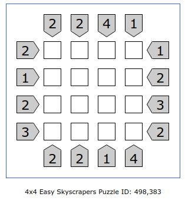

# Skyscraper puzzle solver

Work in progress...

## Example

 (source: [puzzle skyscrapers](https://www.puzzle-skyscrapers.com/?size=0))

```
$ poetry run skyscraper
City size? 4
ROW 0 left value? 2
ROW 0 right value? 1
ROW 1 left value? 1
ROW 1 right value? 2
ROW 2 left value? 2
ROW 2 right value? 3
ROW 3 left value? 3
ROW 3 right value? 2
COLUMN 0 top value? 2
COLUMN 0 bottom value? 2
COLUMN 1 top value? 2
COLUMN 1 bottom value? 2
COLUMN 2 top value? 4
COLUMN 2 bottom value? 1
COLUMN 3 top value? 1
COLUMN 3 bottom value? 4
start round (weight: 64)
(3, 1, 2, 4) (2, 1) ROW 0
(3, 2, 1, 4) (2, 1) ROW 0
(4, 1, 2, 3) (1, 2) ROW 1
(4, 2, 1, 3) (1, 2) ROW 1
(1, 4, 3, 2) (2, 3) ROW 2
(2, 4, 3, 1) (2, 3) ROW 2
(3, 4, 2, 1) (2, 3) ROW 2
(1, 2, 4, 3) (3, 2) ROW 3
(1, 3, 4, 2) (3, 2) ROW 3
(2, 3, 4, 1) (3, 2) ROW 3
(3, 4, 1, 2) (2, 2) COLUMN 0
(2, 1, 4, 3) (2, 2) COLUMN 1
(1, 2, 3, 4) (4, 1) COLUMN 2
(4, 3, 2, 1) (1, 4) COLUMN 3
3|2|1|4
4|1|2|3
1|4|3|2
2|3|4|1
```
